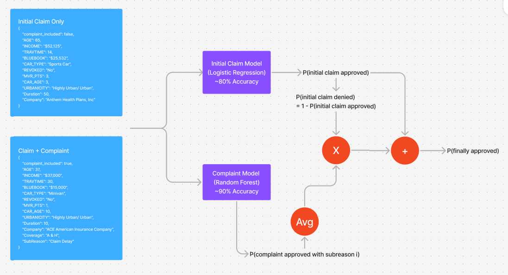

# DataOrbit 2025 -- CashGPT

## How to run

1) cd into main project directory
2) Run the local backend: 
```
cd backend && python -m venv .venv && source .venv/Scripts/activate && pip install -r requirements.txt && python backend_api.py
```
3) Run the local frontend (different terminal): 
```
cd frontend && npm i && npm start
```

